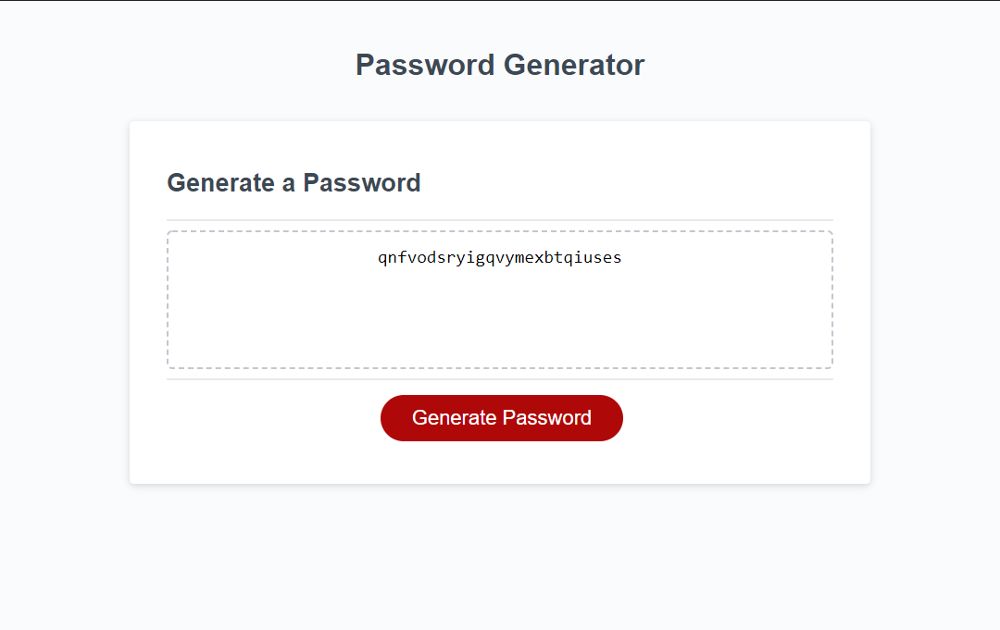

# Password Generator Starter Code

## Site
[https://technicalparadox.github.io/JSPasswordGen](https://technicalparadox.github.io/JSPasswordGen "Launch Site")

## Description
A website which serves as an online password generator. The user can select a length anywhere from 8-128 characters, and choose whether they want to implement lowercase, uppercase, numeric, and/or special characters. The site then uses javascript to generate a suitable password for the user.
